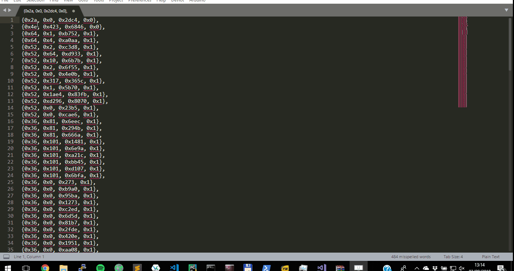

# Alternate Selection

Alternate line selection for Sublime Text 3  

## Installation

Win:   
clone this repository in `%USERPROFILE%\AppData\Roaming\Sublime Text 3\Packages`

Linux:   
clone this repository in `$HOME/.config/sublime-text-3/Packages`

## Usage

<kbd>ctrl</kbd> + <kbd>shift</kbd> + <kbd>P</kbd> => Alternate Selection  
